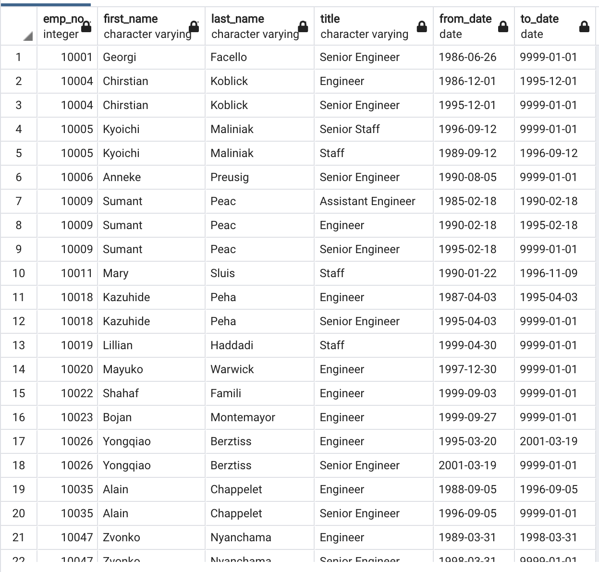
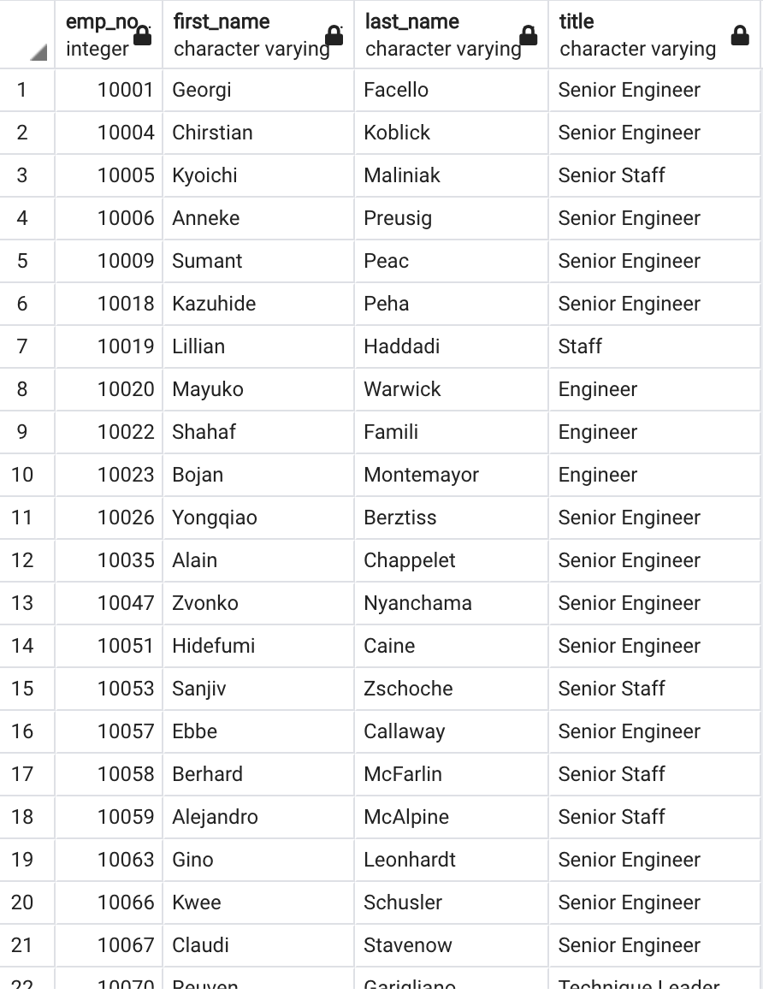
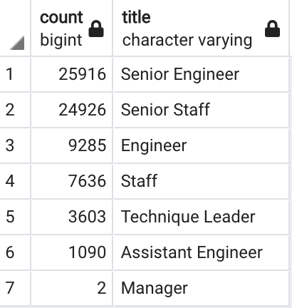
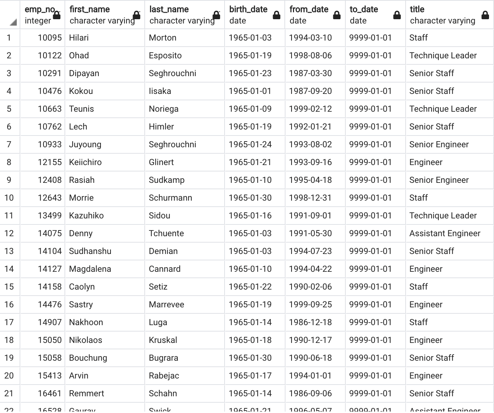

# Pewlett-Hackard-Analysis
## Overview 
In this project we analyzed multiple CSV files about a company's employee information in order to determine which employees were about to retire. We imported all these files into PGAdmin to create tables for each file where we manipluated the data to create new tables and provide detailed analysis.

## Purpose 
The purpose of this analysis was to find all the employees retiring, in what department they were currrently working in, and what title they currently hold. Once this information was stored in newly created tables, we used these tables to provide a new table for the company's mentorship program so they could better prepare for all the new open positions created by all of the retirements.

## Results 
### One Retirement Titles Table
- In this table we filtered employees' birthdates to find all employees born between 1952 and 1955. These employees are approaching retirement age. There are a total of 133,777 rows with duplicates and employees that no longer work at the company in this table so further action must be taken.

### Two Unique Titles Table
- Here all the duplicate employee numbers due to promotions, have been removed as well as all the employees who have already left the company, leaving only the latest title each current employee holds at the moment and leaving the table with only 72,459 rows. This is a more accurate representation of the actual amount of employees retiring.

### Three Retiring Titles Table
- This table represents all the employees retiring per department. The first thing we notice in the retiring_titles table is that the positions Senior Engineer and Senior Staff both have about 25,000 emplooyes about to retire which is a considerable amount.

### Four Mentorship Elegibility Table
- In this table we filtered employees by their birthdate and to_date (final employment date) to only retrieve those born in 1965 and currently employed at the company. This provided us a table with 1,550 rows. This table appears to consist mostly of high level employees such as senior staff, senior engineers, and technical leaders. Also lots of these employees have been working at the company for many years so they would be excellent candidates for mentors in the mentorship program. 

## Summary 
- As per the Unique Titles Table we can see that there will be a total of 72,459 employees retiring in the upcoming years. 

- There are plenty of retirement-ready employees to mentor the next generation of Pewlett Hackard employees.